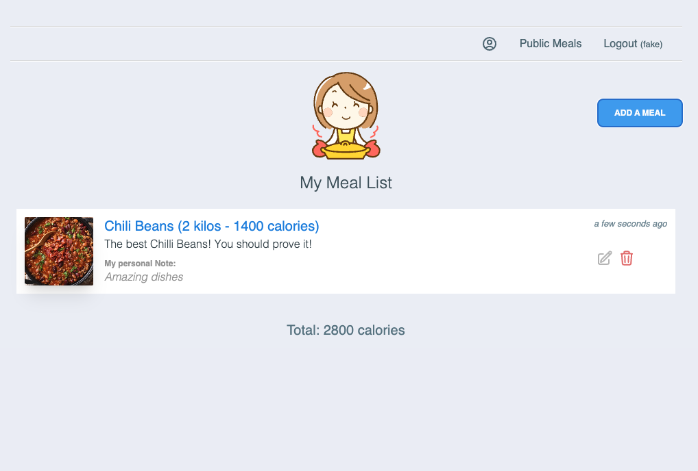
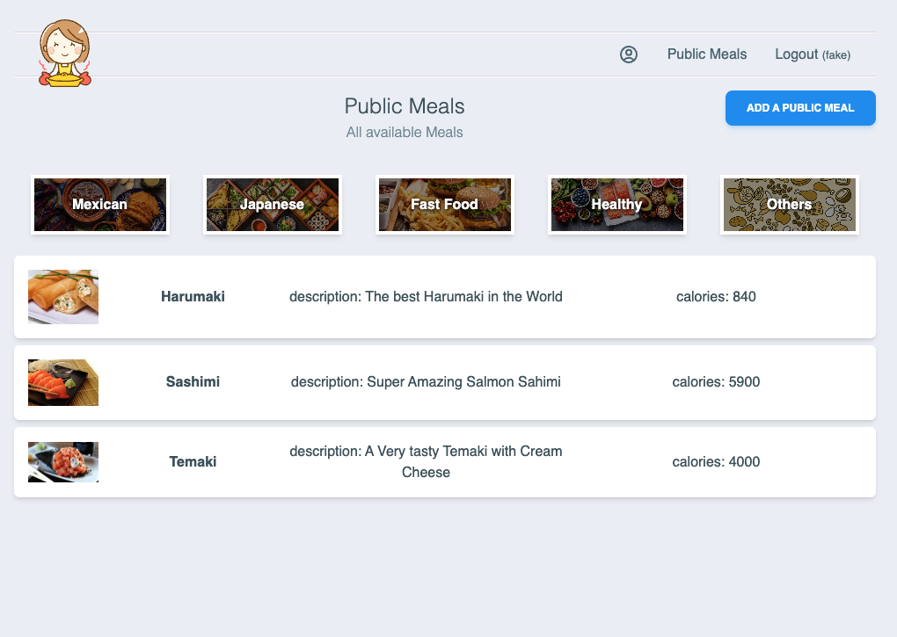
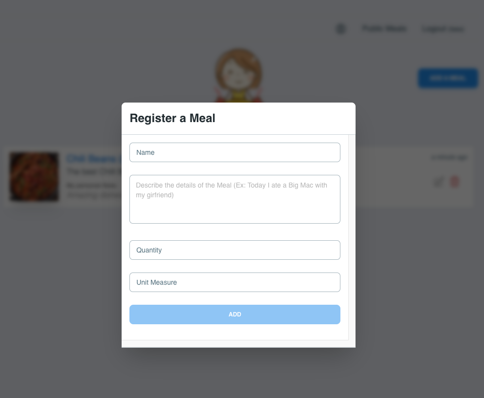

# Meal Info Application
A SPA for measuring user daily meals.

<div style="display: flex">
    
    
    
</div>

## Stack 
`Node.js`  `Prisma.js`  `Express.js`  `React.js`  `Tailwind`  `SQlite3`  `Cypress`

#### Components
- API - Rest endpoints
- Frontend - SPA application (React)
---

# API

#### Requirements
- Nodejs

#### Installing
```sh
npm install
```
#### Configuring
```sh
npm run configure:dev # This will configure the database, and also seed the application
```

#### Running
```sh
npm start
```

#### Testing
```sh
npm test
```

#### Checking

Open [http://localhost:9000](http://localhost:9000)

You can see all available `endpoints` using [postman](https://www.postman.com/). 
You'll need to import [this](/api/Heal.postman_collection.json) collection.

#### API Contexts

- `Auth` - Auth (Mocked)
- `User` - Creates a new User
- `Meal` - Creates a public Meal
- `User Meal` - Inserts a user Meal to the User Meals list
- `Meal Category` - Creates a new Meal Category

---

# Frontend

#### Requirements
- Nodejs

#### Installing
```sh
npm install
```

#### Running
```sh
npm start
```

#### Testing
```sh
npm test
```

#### Checking

Open [http://localhost:5173](http://localhost:5173)
